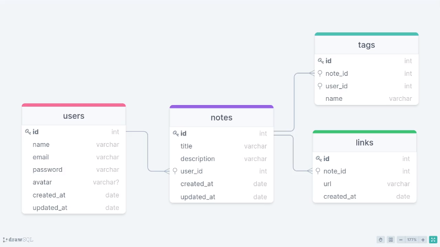
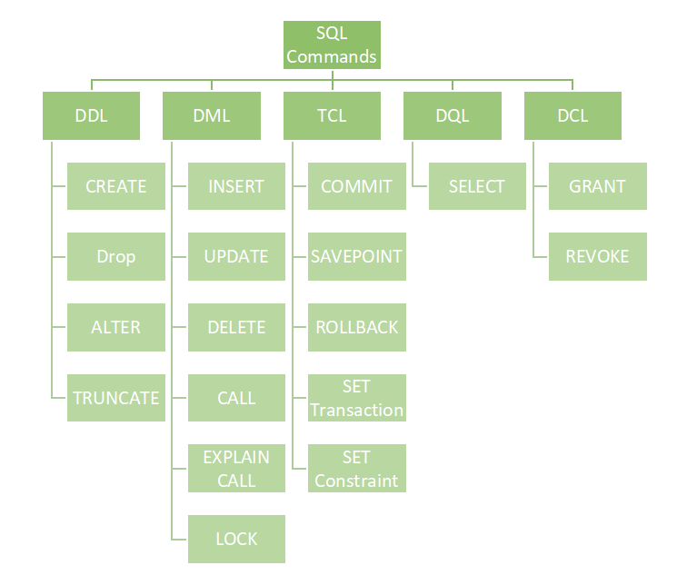

# Database

## Modelo


[drawsql](https://drawsql.app/)


## Banco de dados Relacional 

Um banco de dados relacional é um banco de dados que modela os dados de uma forma que eles sejam percebidos pelo usuário como tabelas, ou mais formalmente relações.

O termo é aplicado aos próprios dados, quando organizados dessa forma, ou a um Sistema Gerenciador de Banco de Dados Relacional (SGBDR) – do inglês Relational database management system (RDBMS) – um programa de computador que implementa a abstração.

## SQLite

O SQLite é uma base de dados relacional de código aberto e que dispensa o uso de um servidor na sua atuação. Armazenando seus arquivos dentro de sua própria estrutura, ele é capaz de funcionar muito bem em aplicações diversas, principalmente, websites de tráfego médio e sistemas mobile.

[https://www.sqlite.org/index.html](https://www.sqlite.org/index.html)

### Instalação

```js
npm i sqlite3 sqlite --save
```

nesse comando estamos executando a instalação do banco de dados **(sqlite)** e do driver **(sqlite3)**.

[npm sqlite](https://www.npmjs.com/package/sqlite)

[Tutorial SQLite e promises](https://sharklabs.com.br/tutorial-node-js-sqlite-promises/)


### Configurando a conexão


> Na estrutura do projeto criamos a pasta `database` dentro de `src` e dentro dela a pasta `sqlite` onde vai ficar o arquivo _index.js_ ref. ao banco de dados.

No arquivo index.js do sqlite, importamos as bibliotecas sqlite

```js
/* /src/database/sqlite/index.js */
const sqlite3 = require('sqlite3') //driver
const sqlite = require('sqlite')  // banco de dados
```

depois de importar as libs criamos a função que vai fazer a conexão do banco de dados sqlite

```js
/* /src/database/sqlite/index.js */

async function sqliteConnection() {
  const database = await sqlite.open({
    filename: path.resolve(__dirname, '..', 'database.db'), // <- lib path
    driver: sqlite3.Database
  })
  return database
}
```

para evitar problemas com o caminho do arquivo a depender do sistema operacional utilizamos o método `resolve` da _lib_ **path** do **node.js**, sendo assim, precisamos fazer a importação mas não é preciso instalar pois ela faz parte do node.

```js
const path = require('path');
```

no método `open` do sqlite recebe como argumento um objeto com: 
- filename: o arquivo que será o banco de dados
- driver: _'mecanismo'_  que vai manipular o banco de dados

sqlite.open retorna uma `promise` então fazemos sua chamada com `await` 
e nossa função dessa forma será assíncrona e recebe a palavra `async`.

Por fim, nossa função retorna `database` com a conexão configurada.

Para que a função possa ser importada nos outros arquivos da aplicação incluímos o comando exports

```js
module.exports = sqliteConnection
```

Com a nossa função de conexão pronta, precisamos agora utilizá-la dentro de `server.js`, importamos 

```js
const database = require("./database/sqlite");
```

e fazemos a chamada 

```js
database()
```

dessa forma se o nosso banco de dados não existir ele será criado na primeira utilização da aplicação.


## SGBD

SGBD (Sistema de Gerenciamento de Banco de Dados) é um software para gestão de bases de dados, que permite criar, modificar e inserir elementos. O termo tem sua origem do inglês Data Base Management System, ou simplesmente DBMS.

Uma ferramenta que usamos para acessar o arquivo de banco de dados enquanto estamos desenvolvendo é o [Beekeeper Studio (Community Edition)](https://github.com/beekeeper-studio/beekeeper-studio).


## SQL
Structured Query language - Linguagem de consulta estruturada, é a linguagem padrão de bancos de dados relacionais. É dividida em grupos de comandos.



### Comandos DDL
Data Definition Language - Linguagem de Definição de Dados são comandos para definição de tabelas. 

### Comandos DML
Data Manipulation Language - Linguagem de Manipulação de Dados são comandos com foco na manipulação de dados.

### Comandos DQL
Data Query Language - Linguagem de Consulta de Dados

### Comandos DCL
Data Control Language - Linguagem de Controle de Dados

### Comandos TCL
Transaction Control Language - Linguagem de Transação de Dados

## Script tabela users

```sql
CREATE TABLE users (
  id INTEGER PRIMARY KEY AUTOINCREMENT,
  name VARCHAR,
  email VARCHAR,
  password VARCHAR,
  avatar VARCHAR NULL,
  created_at TIMESTAMP DEFAULT CURRENT_TIMESTAMP,
  updated_at TIMESTAMP DEFAULT CURRENT_TIMESTAMP
)
```


## Migrations

Migrations é basicamente uma forma de versionar o seu banco de dados.  As migrations operam com três focos: Criação **(Create)**, Alteração **(Alter)** e Remoção **(Drop)** de tabelas. Dessa forma você consegue fazer alterações, criar ou mesmo remover coisas do seu banco de dados.

### tabela users

Criar pasta `migrations` dentro de `/database/sqlite`;

Dentro de `migrations`  criar o arquivo `createUsers.js`, que é o arquivo que vai gerar a tabela _users_.

```js
const createUsers = `
  CREATE TABLE IF NOT EXISTS users (
    id INTEGER PRIMARY KEY AUTOINCREMENT,
    name VARCHAR,
    email VARCHAR,
    password VARCHAR,
    avatar VARCHAR NULL,
    created_at TIMESTAMP DEFAULT CURRENT_TIMESTAMP,
    updated_at TIMESTAMP DEFAULT CURRENT_TIMESTAMP
  );
`;
module.exports = createUsers;
```

> Esse arquivo tem uma constante com a interpolação dos comandos *DDL* de criação da tabela _users_ sendo exportada.

> Note o uso da condição _"IF NOT EXISTS"_ no _CREATE TABLE_ que só vai criar a tabela no *BD* se ela não existir.

Dentro de `migrations` criamos também o arquivo `index.js` responsável por agrupar a execução da criação destas tabelas (um arquivo geral, ponto de entrada quando chamada as migrations).

Neste arquivo importamos a conexão ao **banco de dados** e o _script_ DDl de criação das tabelas


```js
/* /src/database/sqlite/migrations/index.js */
const sqliteConnection = require('../../sqlite'); //conexão DB
const createUsers = require('./createUsers'); // script tabela users
```

Criamos a função que vai executar essas criações de tabelas. 
Essa função é assíncrona pois estamos trabalhando com uma _promisse_ retornada pela conexão ao banco de dados. 
Na função temos a constante _schemas_ onde unimos os _scripts_ DDL (neste caso temos apenas um, o createUsers).
Chamamos a função _sqliteConnection_ que retorna a _promise_ com o banco de dados, em seguida executamos o _script_ em _schemas_ com **db.exec()** e então na sequencia com o _catch_ exibimos no console caso algum erro ocorra. Finalizamos com a exportação da função.

```js
/* /src/database/sqlite/migrations/index.js */

async function migrationsRun() {
  const schemas = [
    createUsers
  ].join('');

  sqliteConnection() // chama conexão BD
    .then((db) => { db.exec(schemas) }) //cria tabelas
    .catch(error => console.error(error)); //mostra se houver erro
}

module.exports = migrationsRun;
```

Com nossa _migration_ pronta substituímos a importação e chamada a _database_ no arquivo `server.js` pela chamada da _migration_.

```js
/* /src/server.js */

// const database = require("./database/sqlite");  //troca por
const migrationsRun = require("./database/sqlite/migrations"); 

//database(); //troca por
migrationsRun()
```

> Desta forma automatizamos a criação do banco de dados (BD) e das tabelas.

## Cadastrando usuários

Com a conexão ao BD e tabela de usuários prontas seguimos para o cadastro de usuários, que pela separação de responsabilidades ficará dentro de `usersController.js`.

Dentro dele temos a classe `UsersController` e o método `create` onde faremos as alterações incluindo a conexão ao BD e a inserção dos dados de usuário recebidos pela rota `/users`.

Primeiro a conexão ao BD importando nosso `sqliteConnection` e criando a chamada ao BD, como a chamada ao banco é assíncrona e retorna uma _promise_, fazemos com a palavra reservada `await` e nossa função `create` recebe a palavra `async` pois agora ela também será uma função assíncrona.

```js
/* /src/controllers/UsersController.js */

const sqliteConnection = require('../database/sqlite'); // importa conexão BD

class UsersController {
  //função assíncrona create
  async create(request, response) { 
    const { name, email, password } = request.body

     const database = await sqliteConnection(); //chamada assíncrona
  }
}
```

A lógica da função create será assim: se NÃO existir nenhum usuário informado na requisição com o mesmo e-mail então inserimos os dados no banco de dados.

Assim fazemos um select no BD para verificar se o email já existe

```js
const checkUserExists = await database.get(
  "SELECT email FROM users WHERE email = (?)",
  [email]
)
```

checkUserExists recebe a resposta da consulta ao BD e caso ela tenha conteúdo lançamos um AppError  encerrando a função create

```js
if (checkUserExists) { 
  throw new AppError("Este e-mail já está em uso.", 406)
}
```

caso esteja vazia (undefine - valor falsy que não entra no if) seguimos com a inserção dos dados

```js
await database.run(
  "INSERT INTO users (name, email, password) VALUES (?, ?, ?)",
  [ name, email, password ]
)
```

## Senha Criptografada

A senha é um dado sensível que não deve ser armazenado de forma exposta no banco de dados, assim precisamos criptografá-la. Nesse projeto utilizaremos para encriptar as senhas o [**bcriptjs**](https://github.com/dcodeIO/bcrypt.js).

Vamos usá-lo não só em desenvolvimento, mas também em produção, então instalamos com o seguinte comando

```bash
npm install bcryptjs
```

e fazemos a importação no topo de `userControllers` da função `hash`

```js
const { hash } = require('bcryptjs')
```
a função `hash()` recebe dois argumentos, a senha em texto recebida e o _salt_ que é o nível de complexidade que será usado no cálculo do _hash_ da senha, nesse caso usamos o valor *8*.

> Hash é uma função assíncrona e retorna uma **promisse**, logo ela recebe a palavra **await** em sua chamada para aguardar-mos o cálculo do hash.

Incluímos esse cálculo antes de passar o password para salvar no BD e trocamos o **insert** para **hashedPassword**

```js
const hashedPassword = await hash(password, 8)

await database.run(
  "INSERT INTO users (name, email, password) VALUES (?, ?, ?)",
  [ name, email, hashedPassword ]
)
```

## Alterando usuários

Para alteração de usuários criamos uma nova rota do tipo **PUT** e também criamos no controller o método responsável por atualizar o usuário.

```javascript
  /* usersController.js */

async update(request, response) {
  const { id } = request.params
  const { name, email } = request.body
      
  response.status(200).json()
}
```
Nesse método recebemos o **id** do usuário por parametro de rota e os outros dados pelo corpo da requisição no formato json. 


```json
{
	"name": "nome",
	"email": "nome@email.com"
}
```

Criamos a rota que vai chamar o método update no arquivo `user.routes.js` (arquivo que concentra as rotas de usuário).

```javascript
/* user.routes.js */

usersRoutes.put("/:id", userController.update)
```

Temos a rota funcional passando os dados necessários para o controller.

Fazemos a conexão ao banco e executamos um select para buscar o usuário com o **id** informado

```javascript
const database = await sqliteConnection()

const user = await database.get("SELECT * FROM users WHERE id = (?)", [ id ])
```

Se o usuário com o **id** informado não for encontrado lançamos um AppError encerrando a requisição

```javascript
if (!user) throw new AppError("Usuário não encontrado!")
```

Se foi encontrado, checamos se o novo email informado já não é usado por outro usuário para isso fazemos um novo select buscando por email e checamos se o id corresponde.

> usamos **lower()** do sql e **toLowerCase()** do javascript para que a busca se torne **case insensitive**

```javascript
// se existir um valor de email comverte para minúsculo caso contrário mantém indefinido
const lowercaseEmail = email ? email.toLowerCase() : undefined

// faz o SELECT comparando os valores em minúsculo
const userWithUpdatedEmail = await database.get("SELECT * FROM users WHERE lower(email) = (?)", [ lowercaseEmail ])

if (userWithUpdatedEmail && userWithUpdatedEmail.id !== user.id) {
  throw new AppError("Este email já está em uso.")
}
```
Se o email existir mas o **id** for de um usuário diferente lançamos um AppError e encerramos a requisição.

Se passar pelas condições então alteramos os dados do usuário retornado pelo **id** e fazemos um UPDATE no banco de dados com os novos dados e retornamos o **response** com status ok.

Como os valores de name e email são opcionais, caso não seja informado mantemos o mesmo valor recebido do banco de dados usando o operador **nullish**.


```javascript
user.name = name ?? user.name
user.email = email ?? user.email

await database.run(
  `UPDATE users SET
  name = ?,
  email = ?,
  updated_at = DATETIME('now')
  WHERE id = ? `,
  [user.name, user.email, id]
)

response.status(200).json()
```
> Para atualizar a data de update usamos a função do próprio banco _SQLite_ **DATETIME('now')** que vai usar o mesmo padrão de data que já está salva no BD.

### Alteração de senha

Dentro da rota update também podemos fazer a alteração da senha para isso precisamos da senha atual e da nova senha e fazemos isso dentro do corpo da requisiçao.

```json
{
	"name": "nome",
	"email": "nome@email.com",
	"password": "1234",
	"new_password": "123456"
}
```

Precisamos receber esses dados também por meio da `request.body`

```javascript
const { name, email, password, new_password  } = request.body
```

Verificamos se caso informado nova senha também foi informado a senha em vigor para validar a alteração.

Se for informada nova senha mas não a atual lançamos um **AppError**.

```javascript
if (new_password && !password) {
  throw new AppError('Informe a senha atual para definir uma nova senha.')
}
```

Quando informada ambas as senhas precisamos verificar se a senha atual é válida, mas a senha gravada no BD está criptografada, para isso usamos o **compare**  do bcriptjs.

Incluímos na importação além do **hash** o **compare**

```javascript
const { hash, compare } = require('bcryptjs')
```
O **compare** faz a comparação de uma *string* com um *hash* então comparamos a senha informada com o hash salvo no banco que já está na variável user onde fizemos o select com o id.

Se as senhas não baterem lançamos um AppErro.

Se estiver correto, fazemos o hash da nova senha e trocamos a que está na variável.

```javascript
if (new_password && password) {
  const checkPassword = await compare(password, user.password)

  if (!checkPassword) {
    throw new AppError('Senha não confere.', 401)
  }

  user.password = await hash(new_password, 8)
}
```
incluímos o password também no update

```javascript
await database.run(
  `UPDATE users SET
  name = ?,
  email = ?,
  password = ?,
  updated_at = datetime('now')
  WHERE id = ? `,
  [user.name, user.email, user.password, id]
)
```

