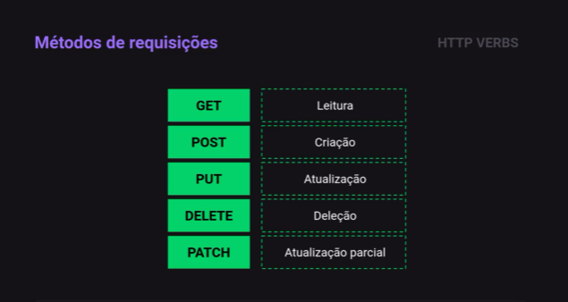
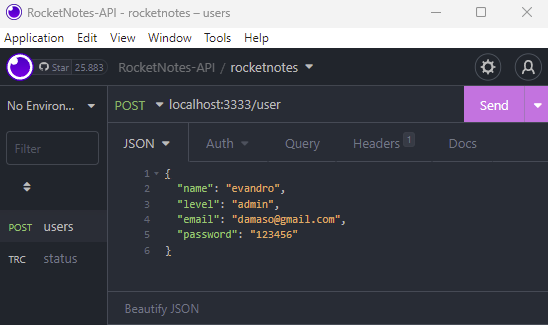
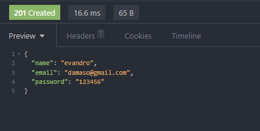
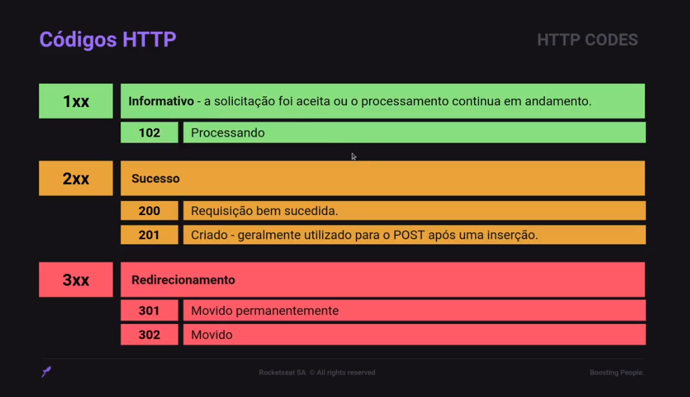
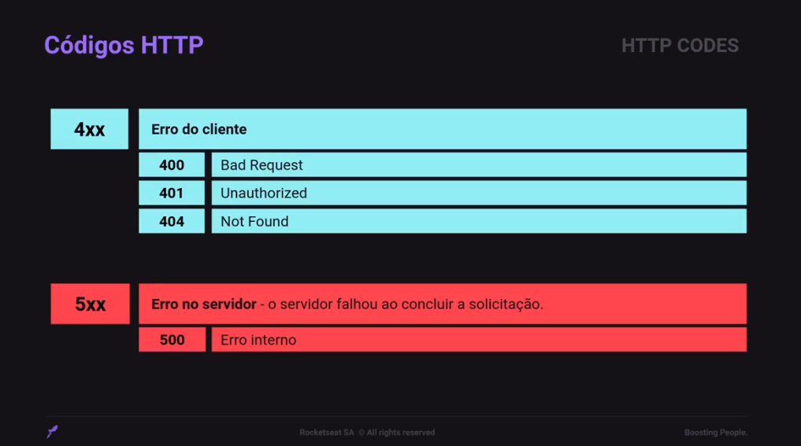
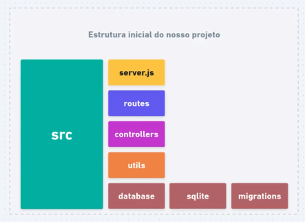
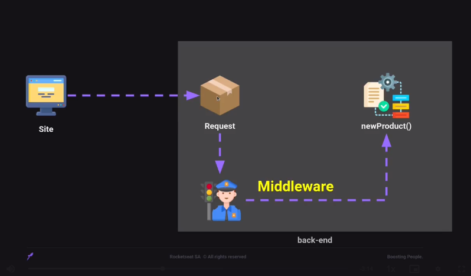

# API / BACKEND

## Node.js

Ambiente javascript para criação de aplicações utilizando a *Engine V8*.

[Site: nodejs.org](https://nodejs.org/)

Iniciar projeto *Node*

+ Crie ou abra a pasta onde deseja criar o projeto.

+ abra o terminal e acesse a pasta

+ execute o comando **npm init**

> npm init -y

opção `-y` 'pula' o modo interativo e cria o arquivo "package.json" com opções padrão. 

O script principal do projeto pode ser incluido na seção `scripts` do arquivo `package.json`

> "start": "node ./src/server.js"

e executado através do comando

> npm start

## NodeMon

Nodemon é um utilitário que monitora o projeto e reinicia o servidor da aplicação automaticamente sempre que uma nova alteração é salva no código, facilitando o trabalho do Dev.

[Site Nodemon](https://nodemon.io/).

### Instalação

```bash 
npm install nodemon --save-dev
```

Com a opção `-D` ou `--save-dev` o Nodemon é instalado somente em ambiente de desenvolvimento. 

Após a instalação do nodemon execute o utilitário através do comando `nodemon` seguido o script JS desta forma:
>nodemon ./src/server.js

ou inclua uma linha em scripts no arquivo `package.json` 
> "dev": "nodemon ./src/server.js"

e execute o comando node npm

> npm run dev


## HTTP Requests

Requisições, métodos ou verbos HTTP, os tipos mais usados são: GET, POST, PUT, DELETE e  PATCH.



Uma lista com outros métodos pode ser vista aqui: [https://developer.mozilla.org/en-US/docs/Web/HTTP/Methods ](https://developer.mozilla.org/en-US/docs/Web/HTTP/Methods)

Com o browser _(Chrome, Firefox, Safari etc.)_ só podemos fazer requisições do tipo **GET**.


Os outros tipos fazemos através do código ou de ferramentas como o [Insomnia](https://insomnia.rest/), [Postman](https://www.postman.com/) ou [Hoppscotch](https://hoppscotch.io/), que são ferramentas usadas para _design_, _debug_ e teste  de **APIs**.


## Express

É uma framework Node.js mínima e flexível para criação de aplicações web como as APIs.

[Site Express](http://expressjs.com/).

### instalar express

```bash
npm i express 
```


## Parâmetros de requisição

Existem 3 maneiras de passarmos informações para o Express através das requisições: [Route Params](#route-params), [Query Params](#query-params) , [Body Params](#body-params)


Veja mais em:
[https://dev.to/gathoni/express-req-params-req-query-and-req-body-4lpc](https://dev.to/gathoni/express-req-params-req-query-and-req-body-4lpc)

---
### Route Params
---

Parâmetro de requisição usado para dados simples mas obrigatórios para acessar a rota.


é passado diretamente na linha de endereço da requisição e declarado com `/:` (barra seguida de dois pontos) na rota do servidor. 

no exemplo abaixo, temos uma requisição *Get* onde `/user` é a rota e `/:id` é o parametro **id**.

Os valores são acessados através de `req.params`

```js
app.get("/user/:id", (req, res) => {
  res.send(`O id do usuário é ${req.params.id}`)
})
```

podem ser passados vários parâmetros em uma mesma rota. Ex:

> "/message/:id/:user"

---
### Query Params
---

Parâmetros mais usado para dados simples mas com valores que podem ser opcionais, pois não são necessários para acessar a rota.


também é passado diretamente na linha de endereço, porém separado da rota por `?` (interrogação) e os parametros separados por `&` (e comercial). 

As queries são passadas no formato `Chave=Valor` e acessadas por meio da `req.query`

```js
app.get("/users", (req, res) => {
  const {page, limit} = req.query
  res.send(`Página: ${page}. Mostrar: ${limit}.`)
})
```

retorna todas as *querys* como resposta

```js
app.get("/users", (req, res) => {
  let message = ''
  for (let query in req.query) {
    message += ` ${query} = ${req.query[query]} | `
  }
  res.send(` ${message}`)
})
```

---
### Body Params
---

Parâmetros passados de forma mais segura, dentro do corpo da requisição. Mais usado quando se cadastra informações.

O corpo da requisição pode ser de vários tipos, por ex: `JSON`, `XML`, `YAML`  e outros.

Para que o Express reconheça o formato do body que está recebendo é preciso configurá-lo antes com `express.json()`.


Essa linha deve ser chamada antes que qualquer rota que faça uso de json seja confugurada. Por isso é recomendado colocá-la logo ao estanciar o express

```js
const app = express(); // app estanciado
app.use(express.json()) // configurado para usar json
```

Chamada `POST` através do Insomnia com corpo da requisição (Body) no formato _Json_:



Os dados são recebidos através do `request.body`:

```js
app.post("/user", (request, response) => {
  const { name, email, password } = request.body // dados enviados no body
  response.status(201).json({ name, email, password }) // resposta json
})
```

No exemplo acima a resposta da requisição também é enviado no formato _Json_. 

Junto da resposta também é enviado o `Status 201`, informando que o usuário foi `Created`, que é um dos [HTTP Codes](#http-codes) que são usados nas respostas de servidores. 




### HTTP Codes

Os **HTTP Codes** ou **Status Codes** são separados em classes com ranges numéricos:  




* Informational responses  (informação)   - de 100 á 199;
* Successful responses (Sucesso)  - de 200 à 299;
* Redirection messages (Redirecionamento)  - de 300 á 399;
* Client error responses (Erro de Cliente)  - de 400 á 499;
* Server error responses (Erro de Servidor)  - de 500 à 599.

> [MDN] HTTP response status codes: [https://developer.mozilla.org/en-US/docs/Web/HTTP/Status](https://developer.mozilla.org/en-US/docs/Web/HTTP/Status)


## Estrutura do projeto

Com o intuito de organizar e facilitar a manutenção do projeto, modularizamos o código
seguindo o modelo a seguir usando a *separação de responsabilidades*:



Na pasta `src` (Source) é onde temos todo o código do projeto.

Arquivo `server.js`, arquivo inicial do projeto, que inicia o serviço.

Pasta `routes` onde mantemos todas as rotas da aplicação.

Pasta `controllers`  com Funções da controllers do express route.

Pasta `utils` com trechos de código pequeno.

Pastas `database`, `sqlite` e `migrations` são relacionadas com os dados, bancos de dados e as versões das tabelas usadas no projeto.

> Esta não é uma estrutura única ou definitiva, pois ela pode ser modificada a depender do projeto.


## Routes

Para agrupar as rotas na pasta `routes` criamos o arquivo `index.js` dentro da pasta, assim, quando fazemos a importação da rota dentro de `server.js` importamos apenas `routes`, pois quando não definimos o arquivo por padrão é chamado o arquivo index.


```js
const routes = require("./routes"); // não é preciso informar index.js
```

Dentro de routes/index.js especificamos as rotas importando `Router` do `express` e exportando as rotas:

```js
/*  ./routes/index.js  */
const { Router } = require("express") //importa o Router

const routes = Router() // estancia o Router

module.exports = routes // exporta o router
```

desta forma `routes` pode ser importado e utilizado dentro de `server.js`

```js
/* server.js */
const express = require("express"); // importa express
const routes = require("./routes"); // importa rotas em routes/index.js

const app = express(); // estancia o app express
app.use(express.json()); // configura para usar formato json
app.use(routes); // configura para usar as rotas 
```

Mas ainda não temos as rotas definidas que ficarão em arquivos separados.

Para as rotas de usuário criamos o arquivo `user.routes.js`  dentro da pasta `routes`.

Nele importamos o `Router` do `express`, estanciamos o `Router`, criamos a rota e exportamos 
a rota para que seja incluída no `index.js`.

```js
/* user.routes.js */
const { Router } = require('express') // importa Router

const usersRoutes = Router() // estancia Router

// criamos uma chamada POST a Rota 'Users'
usersRoutes.post("/", (request, response) => { 
  const { name, email, password } = request.body
  response.status(201).json({ name, email, password })
})

module.exports = usersRoutes // exportamos a rota
```

> note que ao criar a rota definimos como "/" pois o caminho da rota é definida no `index.js`

Agora incluímos a rota `users` no `index.js`

```js
/*  ./routes/index.js  */
const { Router } = require("express") 
const usersRouter = require("./user.routes") // importa user.routes.js

const routes = Router() 
routes.use('/users', usersRouter) // rota '/users' Usa userRouter

module.exports = routes 
```


## Controllers

É a camada responsável por processar as requisições da nossa aplicação, onde temos as regras de negócios. 
Essa camada recebe os pedidos das rotas, processa os pedidos e devolve para rota.

Definimos o controller como uma classe e por convenção nomeamos o arquivo e a classe com a primeira letra maiúscula. 
Na pasta `controllers` criamos o arquivo `UsersController.js`.

```js
/* UsersController.js */
class UsersController {
  // funções
}
module.exports = UsersController // exporta a classe
```

Para manter a separação de responsabilidades o normal é criarmos até 5 funções para o controller: 

1) função de **Index**, método **GET**, para listar vários registros;
2) função de **Show**, método **GET**, para listar um registros específico;
3) função de **Create**, método **POST**, para criar um registro;
4) função de **Update**, método **PUT**, para atualizar um registro;
5) função de **Delete**, método **DELETE**, para remover um registro;

> Se for preciso criar mais do que 5 métodos, talvez esteja na hora de criar um controller a parte.

Seguindo o exemplo, criamos o método `create` dentro da classe `UsersController`

```js
  create(request, response) {
    const { name, email, password } = request.body
    response.status(201).json({ name, email, password })
  }
```

Depois de criado o método, modificamos o `user.routes.js` para que utilize esse controller em sua rota.

Importamos o `controller`, estanciamos a `classe` e passamos o método `create` para a rota.

```js
/* user.routes.js */
const { Router } = require('express')
const UsersController = require('../controllers/UsersController') // importa o controller

const usersRoutes = Router()

const userController = new UsersController() // estancia o controller

usersRoutes.post("/", userController.create) // chamada do método create pela rota

module.exports = usersRoutes
```


## Middlewares 

Middlewares são funções que tem acesso ao objeto de solicitação (requisição), o objeto de resposta (resposta), e a próxima função de middleware no ciclo solicitação-resposta do aplicativo. 



A próxima função middleware é comumente denotada por uma variável chamada _next_.

Um middleware pode: 

* Executar qualquer código

* Fazer mudanças nos objetos de solicitação e resposta

* Encerrar o ciclo de solicitação-resposta

* Chamar o próximo middleware na pilha

> A função que que checa se um usuário tem permissão de acesso a um recurso é um middleware. Ele pode encerrar o acesso ou dar continuidade a pilha caso permitido.

Neste exemplo a função apresenta a mensagem no console _'passou pelo middleware'_ e também mostra o conteúdo da `request.body`.
Para continuar a execução da rota é preciso a chamada `next()`.

```js
/* função de middleware */
function myMiddleware(request, response, next) {
  console.log('Passou pelo middleware')
  console.log(request.body)
  next() // chamada necessária para continuar a pilha
}
```

A função middleware é incluída na rota antes do método `create` separado por `,` (virgula), assim esse middleware é aplicado apenas a essa rota específica.

```js
usersRoutes.post("/", myMiddleware, userController.create) // rota com middleware
```

A rota passa pela middleware e só depois segue para o método create através da chamada next(), sem a next() a pilha não segue para próxima função.


A função middleware também pode ser aplicada a todas as rotas de uma vez. 
Por exemplo, para aplicar essa função a todas as rotas de usuário incluimos
a seguinte linha no arquivo `user.routes.js` antes da definição de rota. 

```js
usersRoutes.use(myMiddleware) // todas as rotas usuário "usam" middleware
```

## Tratamento de Exceções

Tratamento de Exceções nada mais é do que o tratamento de possíveis erros que possam vir a acontecer e travar a aplicação.

Neste exemplo criaremos a classe `AppError` dentro da pasta `utils`.

```js
/* /src/utils/AppError.js */

class AppError {
  message;
  statusCode;

  constructor(message, statusCode = 400) {
    this.message = message
    this.statusCode = statusCode
  }
}

module.exports = AppError
```
 
e incluir a importação no usersController 

```js
/* /src/controllers/UsersController.js */

const AppError = require('../utils/AppError') // importa a classe de erro

class UsersController {
  create(request, response) {
    const { name, email, password } = request.body

    if(!name) throw new AppError("Nome é obrigatório") // lança um erro SE nome não informado

    response.status(201).json({ name, email, password })
  }
}

module.exports = UsersController
```

Agora para trabalharmos com os erros na aplicação instalamos a biblioteca [express-async-errors](https://www.npmjs.com/package/express-async-errors).

```bash
npm i express-async-errors
```

imcluímos as requisições de `express-async-errors` e `appError` no `server.js`

```js
require('express-async-errors'); //importe antes instanciar as rotas


const AppError = require('./utils/AppError')
```
---
> IMPORTANTE

A linha _require_ de `express-async-errors` deve vir antes da _require_ de `routes` caso contrário ao lançar um erro temos uma falha na aplicação com erro `triggerUncaughtException` com código *ERR_UNHANDLED_REJECTION*.

---

e incluímos também um `app.use()` com uma função de tratamento de erros, que neste caso é uma arrow function.

```js
app.use((error, request, response, next) => {
  // se erro da aplicação -> erro do tipo AppError
  if (error instanceof AppError) { 
    return response.status(error.statusCode)
      .json({
        status: "error",
        message: error.message
      })
  }

  // qualquer outro erro
  return response.status(500)
    .json({
      status: "error",
      message: "internal server error"
    })
})
```


